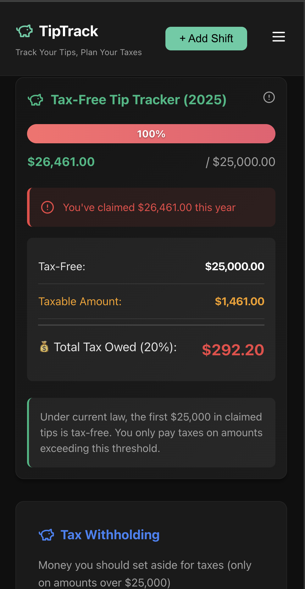

# TipTrack 💰
<div align="center">
  
  
  
  
  
</div>

# TipTrack 💰

_Built by a bartender, for bartenders._


---

## 📖 What Is TipTrack?

A **full-stack MERN application** that helps service industry workers:
- Track **actual tips vs claimed tips** (for tax purposes)
- Auto-calculate **tax withholding** based on your rate
- Stay under the **$25,000 tax-free threshold** (2024 IRS law)
- View earnings by day, week, month, and year
- **Secure user authentication** with JWT tokens

Built by a bartender — **battle-tested on real shifts**.  
Deployed with **Docker + Kubernetes** to showcase **DevOps/SRE skills**.

---

## 🏗️ Architecture

```
User → Frontend (LoadBalancer)
        ↓
     Backend (ClusterIP) + Auth Routes
        ↓
    MongoDB + PVC (ClusterIP)
```

**Kubernetes Components:**
- **3 Deployments:** Frontend (2 replicas), Backend (2 replicas), MongoDB (1 replica)
- **3 Services:** Frontend (LoadBalancer), Backend (ClusterIP), MongoDB (ClusterIP)
- **1 PVC:** Persistent storage for MongoDB data
- **Health Probes:** Liveness and readiness checks
- **Self-Healing:** Kubernetes restarts failed pods automatically

---

## 🎯 Key Features

- ✅ **User Authentication** - Secure signup/login with JWT tokens (90-day expiration)
- ✅ **Beautiful Animated UI** - Neon-style login with gradient borders and smooth animations
- ✅ **Password Security** - Bcrypt hashing with show/hide toggle
- ✅ **Add/Edit/Delete Shifts** - Track every shift you work
- ✅ **Cash vs Credit Tips** - Separate tracking or total entry
- ✅ **Tax Calculator** - Auto-calculates withholding (claimed × rate)
- ✅ **Dashboard** - Today, week, month, and total stats
- ✅ **$25K Tax-Free Tracker** - Know exactly how much is tax-free
- ✅ **Persistent Data** - MongoDB with persistent volume
- ✅ **Self-Healing** - Kubernetes auto-restarts failed pods
- ✅ **Health Probes** - Liveness and readiness checks

---

## 🛠️ Tech Stack

### Frontend
- React 18 (with Vite)
- Axios for API calls
- Lucide-React icons (including eye toggle for passwords)
- Modern animated neon theme UI
- JWT token storage (localStorage)

### Backend
- Node.js + Express
- MongoDB + Mongoose
- **bcryptjs** - Password hashing
- **jsonwebtoken** - JWT authentication
- CORS enabled
- RESTful API design

### DevOps
- Docker (multi-stage builds)
- Kubernetes (Deployments, Services, ConfigMaps, Secrets)
- Minikube (local development cluster)
- Health checks (liveness + readiness probes)

---

## 🚀 Quick Start

### Prerequisites

1. **Install required software:**
   ```bash
   # Docker Desktop (must be running)
   # Download: https://www.docker.com/products/docker-desktop
   
   # Minikube
   brew install minikube
   
   # kubectl
   brew install kubectl
   ```

2. **Install project dependencies:**
   ```bash
   # Backend
   cd backend
   npm install
   npm install cors bcryptjs jsonwebtoken  # ⚠️ REQUIRED for API and auth!
   
   # Frontend
   cd ../frontend
   npm install
   npm install lucide-react  # ⚠️ REQUIRED for eye icon and UI!
   ```

3. **Set up environment variables:**
   
   **Backend** (`backend/.env`):
   ```env
   MONGODB_URI=mongodb://mongodb-service:27017/tiptrack
   PORT=5000
   JWT_SECRET=your-super-secret-key-change-this-in-production
   ```
   
   **Frontend** (`frontend/.env`):
   ```env
   VITE_API_URL=http://localhost:5000
   ```

### Deploy to Kubernetes

**Quick version:**
```bash
# 1. Start Minikube
minikube start --cpus=4 --memory=4096 --driver=docker

# 2. Build images in Minikube
eval $(minikube docker-env)
cd backend && docker build -t tiptrack-backend:latest .
cd ../frontend && docker build -t tiptrack-frontend:latest .

# 3. Deploy
cd ..
kubectl apply -f k8s/

# 4. Wait for pods to be ready
kubectl get pods -n tiptrack -w
# Press Ctrl+C when all show Running

# 5. Access the app (see Daily Usage section below)
```

---

## 📄 Daily Usage

**Every time you want to use the app:**

### Step 1: Check Minikube
```bash
minikube status
# If stopped: minikube start
```

### Step 2: Open 2 Terminals (Keep Both Running!)

**Terminal 1 (Backend):**
```bash
kubectl port-forward -n tiptrack service/backend-service 5000:5000
```

**Terminal 2 (Frontend):**
```bash
kubectl port-forward -n tiptrack service/frontend-service 3000:80
```

### Step 3: Open Browser
```
http://localhost:3000
```

**First time?** Create an account on the animated login screen!

**✅ Ports never change! Always localhost:3000**

---

## 🔌 API Endpoints

**Base URL:** `http://localhost:5000`

### Authentication Routes
| Method | Endpoint | Description |
|--------|----------|-------------|
| POST | `/api/auth/signup` | Create new user account |
| POST | `/api/auth/login` | Login and get JWT token |

### Shift Routes
**Base:** `/api/shifts`

| Method | Endpoint | Description |
|--------|----------|-------------|
| GET | `/health` | Health check |
| GET | `/` | Get all shifts (requires auth) |
| GET | `/:id` | Get shift by ID (requires auth) |
| POST | `/` | Create new shift (requires auth) |
| PUT | `/:id` | Update shift (requires auth) |
| DELETE | `/:id` | Delete shift (requires auth) |
| GET | `/stats/summary` | Get dashboard stats (requires auth) |

---

## 📁 Project Structure

```
tiptrack/
├── backend/                # Node.js + Express API
│   ├── models/            # Mongoose schemas
│   │   ├── Shift.js      # Shift data model
│   │   └── User.js       # User authentication model
│   ├── routes/            # API endpoints
│   │   ├── shifts.js     # Shift CRUD operations
│   │   └── auth.js       # Login/signup endpoints
│   ├── server.js          # Main server file
│   └── Dockerfile         # Backend container image
├── frontend/              # React + Vite app
│   ├── src/
│   │   ├── components/   # React components
│   │   │   └── Login.jsx # Animated login component
│   │   ├── services/     # API client
│   │   │   └── api.js   # Axios + JWT configuration
│   │   └── styles/       # CSS files
│   ├── Dockerfile        # Frontend container image
│   ├── nginx.conf        # Nginx configuration
│   └── vite.config.js    # Vite build config
├── k8s/                   # Kubernetes manifests
│   ├── namespace.yaml     # tiptrack namespace
│   ├── mongodb/           # Database resources
│   ├── backend/           # API resources
│   └── frontend/          # UI resources
└── README.md
```

---

## 🔐 Security Features

- ✅ **Password hashing** with bcrypt (10 salt rounds)
- ✅ **JWT token authentication** (90-day expiration)
- ✅ **CORS** configured for cross-origin requests
- ✅ **Environment variables** for secrets
- ✅ **Kubernetes Secrets** for sensitive data
- ✅ **Authorization headers** on protected routes

---

## 📊 Kubernetes Features Demonstrated

- ✅ **Multi-container deployment** - Frontend, Backend, MongoDB
- ✅ **Service discovery** - Services communicate via DNS
- ✅ **Persistent storage** - PVC for MongoDB data
- ✅ **Secrets management** - MongoDB credentials + JWT secrets
- ✅ **ConfigMaps** - Environment configuration
- ✅ **Health probes** - Liveness and readiness checks
- ✅ **Rolling updates** - Zero-downtime deployments
- ✅ **Auto-scaling** - Multiple replicas for high availability
- ✅ **Self-healing** - Automatic pod restarts

---

## 🧪 Testing

```bash
# Check all resources
kubectl get all -n tiptrack

# View pod logs
kubectl logs <pod-name> -n tiptrack

# Check health endpoint
curl http://localhost:5000/health

# Test signup
curl -X POST http://localhost:5000/api/auth/signup \
  -H "Content-Type: application/json" \
  -d '{"username":"testuser","password":"test123"}'

# Test login
curl -X POST http://localhost:5000/api/auth/login \
  -H "Content-Type: application/json" \
  -d '{"username":"testuser","password":"test123"}'

# Get service URLs
minikube service list -n tiptrack
```

---

## 🛠️ Troubleshooting

**Common issues and solutions:**

**1. Pods not starting:**
```bash
# Check pod status
kubectl get pods -n tiptrack

# View pod logs for errors
kubectl logs <pod-name> -n tiptrack

# Describe pod for events
kubectl describe pod <pod-name> -n tiptrack
```

**2. Can't access the app:**
```bash
# Verify services are running
kubectl get svc -n tiptrack

# Check if port-forward is active
# Make sure both terminals with port-forward are still running

# Try restarting port-forward
# Kill the terminal process and run the commands again
```

**3. MongoDB connection issues:**
```bash
# Check MongoDB pod logs
kubectl logs <mongodb-pod> -n tiptrack

# Verify MongoDB service
kubectl get svc mongodb-service -n tiptrack

# Check backend logs for connection errors
kubectl logs <backend-pod> -n tiptrack | grep MongoDB
```

**4. Images not found:**
```bash
# Make sure you built images in Minikube's environment
eval $(minikube docker-env)

# Rebuild images
cd backend && docker build -t tiptrack-backend:latest .
cd ../frontend && docker build -t tiptrack-frontend:latest .

# Redeploy
kubectl rollout restart deployment -n tiptrack
```

**Full reset (last resort):**
```bash
kubectl delete namespace tiptrack
minikube stop
minikube start
# Then re-deploy: kubectl apply -f k8s/
```

---

## 🧹 Cleanup

```bash
# Delete everything
kubectl delete namespace tiptrack

# Stop Minikube
minikube stop

# Delete Minikube cluster (optional - frees up disk space)
minikube delete

# Clear browser data (logout)
# Open browser console (F12) and run:
localStorage.clear()
```

---

## 🎤 Interview Talking Points

### Why Kubernetes?
> "I chose Kubernetes to demonstrate container orchestration, service discovery, and self-healing infrastructure. The app showcases key concepts like persistent storage, health checks, and zero-downtime deployments - all critical for SRE roles."

### Technical Implementation
> "I implemented a 3-tier architecture with separate frontend, backend, and database services. Each service has multiple replicas for high availability, persistent volumes for data durability, and health probes for automatic recovery. The entire stack is defined as code using Kubernetes manifests."

### Challenges Faced
> "The main challenge was Kubernetes networking in Minikube. Services use internal DNS (like `backend-service`), which works inside the cluster but not from a browser. I solved this using `kubectl port-forward` to map localhost ports directly to services, creating a consistent development workflow."

### What I Learned
> "This project taught me how to think about infrastructure as code, handle service discovery, manage secrets securely, and implement self-healing systems. I also gained hands-on experience with persistent storage, rolling updates, and troubleshooting containerized applications."

### Production Improvements
> "For production, I'd implement: Ingress controller with TLS for external access, managed database (like AWS RDS) for better reliability, HashiCorp Vault for secrets management, Horizontal Pod Autoscaler for dynamic scaling, and monitoring with Prometheus/Grafana for observability."

---

## 📊 What This Project Demonstrates

### For SRE/DevOps Roles:

**Kubernetes Expertise:**
- Container orchestration with Kubernetes
- Service discovery and networking
- Persistent storage with PVCs
- ConfigMaps and Secrets management
- Health checks (liveness/readiness probes)
- Self-healing and auto-scaling
- Multi-container deployments
- Rolling updates and zero-downtime deployments

**Docker Skills:**
- Multi-stage builds
- Container optimization
- Image management
- Dockerfile best practices

**Infrastructure as Code:**
- YAML manifests for all resources
- Declarative configuration
- Version-controlled infrastructure
- Reproducible deployments

### For Full-Stack Roles:

- MERN stack implementation
- RESTful API design
- JWT authentication from scratch
- Responsive UI with animations
- State management in React
- Password hashing and security best practices

### Key Competencies:

✅ "Deployed a full-stack application using Kubernetes with 3-tier architecture"  
✅ "Implemented container orchestration with self-healing, persistent storage, and service discovery"  
✅ "Configured health probes, secrets management, and rolling updates"  
✅ "Built a production-ready authentication system with JWT and bcrypt"  
✅ "Demonstrated infrastructure as code with version-controlled Kubernetes manifests"

---

## 🚀 Alternative Deployment: Docker Compose

**Want a simpler way to run the app? Use Docker Compose!**

```bash
# Start everything
docker-compose up --build

# Open browser
# Frontend: http://localhost:3000
# Backend: http://localhost:5001

# Stop everything
docker-compose down
```

**What docker-compose does:**
- Starts MongoDB on port 27017
- Starts Backend API on port 5001
- Starts Frontend on port 3000
- Connects them all together
- Saves data in a Docker volume

**Use this for:**
- Quick testing
- Local development
- When you don't need to demo Kubernetes skills

---

## 📝 License

MIT License - feel free to use this project for learning or your portfolio!

---

## 🙏 Acknowledgments

Built as a portfolio project to demonstrate:
- Full-stack development (MERN)
- User authentication with JWT
- Modern animated UI design
- **Containerization** (Docker)
- **Container orchestration** (Kubernetes)
- DevOps/SRE practices
- Security best practices

**Perfect for bootcamp grads looking to break into SRE/DevOps roles!** 🚀

---

## 👤 Author

**Tina Bajwa**  
Bootcamp Grad + SRE Intern  
Building real-world projects to showcase DevOps skills

*"Track your tips. Automate your taxes. Deploy with Kubernetes."* 🚀