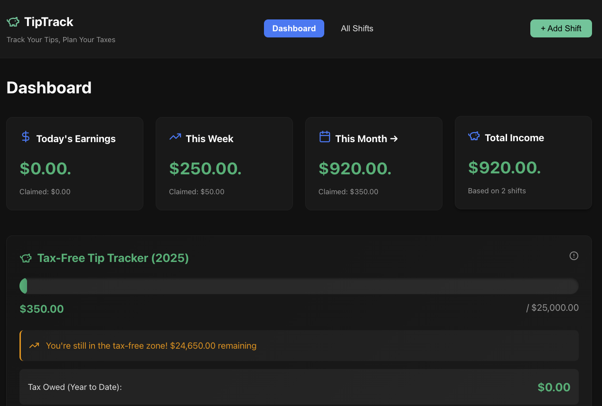
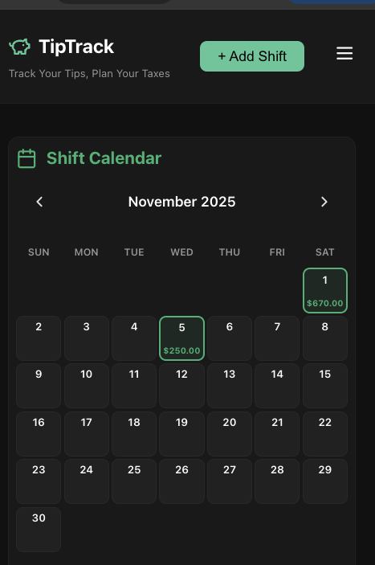
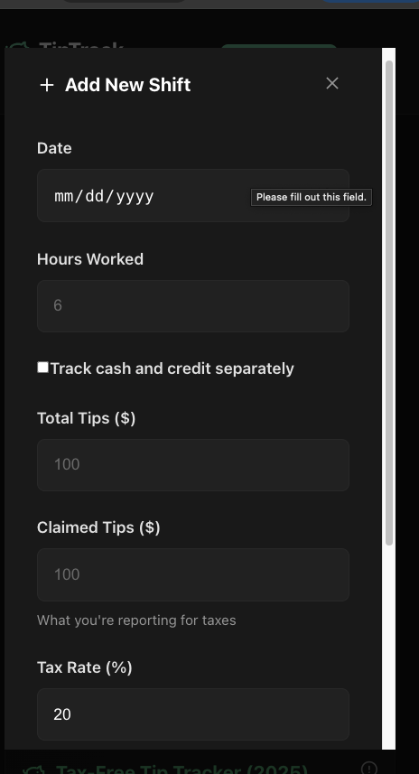

# TipTrack 💰





_Built by a bartender, for bartenders._


---

## 📖 What Is TipTrack?

A **full-stack MERN application** that helps service industry workers:
- Track **actual tips vs claimed tips** (for tax purposes)
- Auto-calculate **tax withholding** based on your rate
- Stay under the **$25,000 tax-free threshold** (2024 IRS law)
- View earnings by day, week, month, and year
- **Secure user authentication** with JWT tokens

Built by a bartender — **battle-tested on real shifts**.  
Deployed with **Docker + Kubernetes** to showcase **DevOps/SRE skills**.

---

## 🎯 Key Features

- ✅ **User Authentication** - Secure signup/login with JWT tokens (90-day expiration)
- ✅ **Beautiful Animated UI** - Neon-style login with gradient borders and smooth animations
- ✅ **Password Security** - Bcrypt hashing with show/hide toggle
- ✅ **Add/Edit/Delete Shifts** - Track every shift you work
- ✅ **Cash vs Credit Tips** - Separate tracking or total entry
- ✅ **Tax Calculator** - Auto-calculates withholding (claimed × rate)
- ✅ **Dashboard** - Today, week, month, and total stats
- ✅ **$25K Tax-Free Tracker** - Know exactly how much is tax-free
- ✅ **Persistent Data** - MongoDB with persistent volume
- ✅ **Self-Healing** - Kubernetes auto-restarts failed pods
- ✅ **Health Probes** - Liveness and readiness checks

---

## 🏗️ Architecture

```
User → Frontend (LoadBalancer)
        ↓
     Backend (ClusterIP) + Auth Routes
        ↓
    MongoDB + PVC (ClusterIP)
```

**Components:**
- **3 Deployments:** Frontend (2 replicas), Backend (2 replicas), MongoDB (1 replica)
- **3 Services:** Frontend (LoadBalancer), Backend (ClusterIP), MongoDB (ClusterIP)
- **1 PVC:** Persistent storage for MongoDB data
- **Health Probes:** Auto-healing and traffic management
- **Authentication:** JWT-based secure login system

---

## 🛠️ Tech Stack

### Frontend
- React 18 (with Vite)
- Axios for API calls
- Lucide-React icons (including eye toggle for passwords)
- Modern animated neon theme UI
- JWT token storage (localStorage)

### Backend
- Node.js + Express
- MongoDB + Mongoose
- **bcryptjs** - Password hashing
- **jsonwebtoken** - JWT authentication
- CORS enabled
- RESTful API design

### DevOps
- Docker (multi-stage builds)
- Kubernetes (Deployments, Services, ConfigMaps, Secrets)
- Minikube (local development cluster)
- Health checks (liveness + readiness probes)

---

## 🚀 Quick Start

### Prerequisites

1. **Install required software:**
   ```bash
   # Docker Desktop (must be running)
   # Download: https://www.docker.com/products/docker-desktop
   
   # Minikube
   brew install minikube
   
   # kubectl
   brew install kubectl
   ```

2. **Install project dependencies:**
   ```bash
   # Backend
   cd backend
   npm install
   npm install cors bcryptjs jsonwebtoken  # ⚠️ REQUIRED for API and auth!
   
   # Frontend
   cd ../frontend
   npm install
   npm install lucide-react  # ⚠️ REQUIRED for eye icon and UI!
   ```

3. **Set up environment variables:**
   
   **Backend** (`backend/.env`):
   ```env
   MONGODB_URI=mongodb://localhost:27017/tiptrack
   PORT=5000
   JWT_SECRET=your-super-secret-key-change-this-in-production
   ```
   
   **Frontend** (`frontend/.env`):
   ```env
   VITE_API_URL=http://localhost:5000/api/shifts
   ```

### Deploy to Kubernetes

**Quick version:**
```bash
# 1. Start Minikube
minikube start --cpus=4 --memory=4096 --driver=docker

# 2. Build images in Minikube
eval $(minikube docker-env)
cd backend && docker build -t tiptrack-backend:latest .
cd ../frontend && docker build -t tiptrack-frontend:latest .

# 3. Deploy
cd ..
kubectl apply -f k8s/

# 4. Wait for pods to be ready
kubectl get pods -n tiptrack -w
# Press Ctrl+C when all show Running

# 5. Access the app (see Daily Usage section below)
```

---

## 🐳 Run with Docker Compose (Simpler Alternative)

**Want to skip Kubernetes and just test the app? Use Docker Compose!**

```bash
# 1. Start everything
docker-compose up --build

# 2. Open browser
# Frontend: http://localhost:3000
# Backend: http://localhost:5001

# 3. Stop everything
docker-compose down
```

**That's it!** No Minikube, no tunnels, no 3 terminals. Just works. ✅

**What docker-compose does:**
- Starts MongoDB on port 27017
- Starts Backend API on port 5001
- Starts Frontend on port 3000
- Connects them all together
- Saves data in a Docker volume

**Use this for:**
- Quick testing
- Local development
- When you don't need to show Kubernetes skills

---

## 🔄 Daily Usage (Kubernetes)

**Every time you want to use the app:**

### Step 1: Check Minikube
```bash
minikube status
# If stopped: minikube start
```

### Step 2: Open 2 Terminals (Keep Both Running!)

**Terminal 1 (Backend):**
```bash
kubectl port-forward -n tiptrack service/backend-service 5000:5000
```

**Terminal 2 (Frontend):**
```bash
kubectl port-forward -n tiptrack service/frontend-service 3000:80
```

### Step 3: Open Browser
```
http://localhost:3000
```

**First time?** Create an account on the animated login screen!

**✅ Ports never change! Always localhost:3000**

---

## 🔐 Authentication System

### Features
- **Secure signup/login** with JWT tokens
- **Password hashing** with bcrypt (10 salt rounds)
- **90-day token expiration** (configurable)
- **Show/hide password toggle** with eye icon
- **Beautiful animated login UI** with neon effects
- **Error handling** with shake animations

### How It Works
1. User signs up → Password hashed → JWT token created
2. Token saved in localStorage (90-day expiration)
3. Each API request includes token in Authorization header
4. Backend verifies token before processing requests

### Security Best Practices Implemented
- ✅ Passwords never stored as plain text
- ✅ JWT tokens expire after 90 days
- ✅ Tokens include user ID only (minimal payload)
- ✅ HTTPS recommended for production
- ✅ Token stored in localStorage (not cookies for simplicity)

---

## 📁 Project Structure

```
tiptrack/
├── backend/                # Node.js + Express API
│   ├── models/            # Mongoose schemas
│   │   ├── Shift.js      # Shift data model
│   │   └── User.js       # User authentication model
│   ├── routes/            # API endpoints
│   │   ├── shifts.js     # Shift CRUD operations
│   │   └── auth.js       # Login/signup endpoints
│   ├── server.js          # Main server file
│   └── Dockerfile         # Backend container image
├── frontend/              # React + Vite app
│   ├── src/
│   │   ├── components/   # React components
│   │   │   └── Login.jsx # Animated login component
│   │   ├── services/     # API client
│   │   └── styles/       # CSS files
│   │       └── Login.css # Neon animated styles
│   └── Dockerfile        # Frontend container image
└── k8s/                   # Kubernetes manifests
    ├── namespace.yaml     # tiptrack namespace
    ├── mongodb/           # Database resources
    ├── backend/           # API resources
    └── frontend/          # UI resources
```

---

## 🔌 API Endpoints

**Base URL:** `http://localhost:5000`

### Authentication Routes
| Method | Endpoint | Description |
|--------|----------|-------------|
| POST | `/api/auth/signup` | Create new user account |
| POST | `/api/auth/login` | Login and get JWT token |

### Shift Routes
**Base:** `/api/shifts`

| Method | Endpoint | Description |
|--------|----------|-------------|
| GET | `/health` | Health check |
| GET | `/` | Get all shifts |
| GET | `/:id` | Get shift by ID |
| POST | `/` | Create new shift |
| PUT | `/:id` | Update shift |
| DELETE | `/:id` | Delete shift |
| GET | `/stats/summary` | Get dashboard stats |
| GET | `/stats/month` | Get monthly stats |

---

## 🔧 Configuration

### Environment Variables

**Backend** (`backend/.env`):
```env
MONGODB_URI=mongodb://mongodb-service:27017/tiptrack
PORT=5000
JWT_SECRET=your-super-secret-key-change-this-in-production
```

**Frontend** (`frontend/.env`):
```env
VITE_API_URL=http://localhost:5000/api/shifts
```

**Note:** Frontend uses `localhost:5000` because `kubectl port-forward` maps it to the backend service.

---

## 🧪 Testing

```bash
# Check all resources
kubectl get all -n tiptrack

# View pod logs
kubectl logs <pod-name> -n tiptrack

# Check health endpoint
curl http://localhost:5000/health

# Test signup
curl -X POST http://localhost:5000/api/auth/signup \
  -H "Content-Type: application/json" \
  -d '{"username":"testuser","password":"test123"}'

# Test login
curl -X POST http://localhost:5000/api/auth/login \
  -H "Content-Type: application/json" \
  -d '{"username":"testuser","password":"test123"}'

# Get service URLs
minikube service list -n tiptrack
```

---

## 🐛 Troubleshooting

**Common issues and solutions:** See [DEPLOYMENT.md](./DEPLOYMENT.md#-troubleshooting)

**Quick checks:**
```bash
# Are all pods running?
kubectl get pods -n tiptrack

# Check pod logs for errors
kubectl logs <pod-name> -n tiptrack

# Verify services exist
kubectl get svc -n tiptrack

# Check MongoDB connection
kubectl logs <backend-pod> -n tiptrack | grep MongoDB

# Check auth routes are loaded
kubectl logs <backend-pod> -n tiptrack | grep auth
```

**Port conflicts?**
```bash
# If port 5000 is in use (macOS Control Center):
# Change backend/.env to PORT=5001
# Update frontend API calls to use 5001
```

---

## 📊 Kubernetes Features Demonstrated

- ✅ **Multi-container deployment** - Frontend, Backend, MongoDB
- ✅ **Service discovery** - Services communicate via DNS
- ✅ **Persistent storage** - PVC for MongoDB data
- ✅ **Secrets management** - MongoDB credentials + JWT secrets
- ✅ **ConfigMaps** - Environment configuration
- ✅ **Health probes** - Liveness and readiness checks
- ✅ **Rolling updates** - Zero-downtime deployments
- ✅ **Auto-scaling** - Multiple replicas for high availability
- ✅ **Self-healing** - Automatic pod restarts

---

## 🧹 Cleanup

```bash
# Delete everything
kubectl delete namespace tiptrack

# Stop Minikube
minikube stop

# Delete Minikube cluster
minikube delete

# Clear browser data (logout)
# Open browser console (F12) and run:
localStorage.clear()
```

---

## 📝 License

MIT License - feel free to use this project for learning or your portfolio!

---

## 🙏 Acknowledgments

Built as a portfolio project to demonstrate:
- Full-stack development (MERN)
- User authentication with JWT
- Modern animated UI design
- Containerization (Docker)
- Container orchestration (Kubernetes)
- DevOps/SRE practices
- Security best practices (password hashing, token expiration)

**Perfect for bootcamp grads looking to break into SRE roles!** 🚀

---

## 📚 Documentation

- [Deployment Guide](./DEPLOYMENT.md) - Complete setup instructions
- [API Documentation](#-api-endpoints) - Endpoint reference
- [Troubleshooting](./DEPLOYMENT.md#-troubleshooting) - Common issues and fixes

---

## 🎨 Design Credits

Login page inspired by modern neon UI designs with:
- Animated gradient borders
- Glass-morphism effects
- Smooth hover animations
- Floating background elements

---

**Questions? Issues?** Open an issue or reach out! 💪

---

## 👤 Author

**Tina Bajwa**  
Built as a hands-on DevOps learning journey.  
*"Track your tips. Automate your taxes. Learn Kubernetes."*